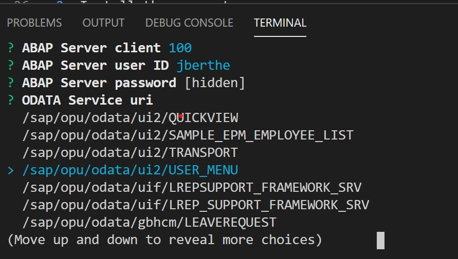

[](https://badge.fury.io/js/generator-app-fiori)
[](https://circleci.com/gh/atom/github/tree/master)
[](https://coveralls.io/github/jberthe/generator-app-fiori?branch=master)
[](https://opensource.org/licenses/Apache-2.0)

# Description
This generator creates a Fiori application based on Work-List template. It uses the last UI5 Tooling to make your life easier. The generated project embed alse a Fiori Launchpad Sandbox to integrate a SAPui5 Component. You do not need to create an `index.html` to load your project.

This template is for Fiori programmers which develop on *On-Premise ABAP system*.

We have added a cool feature during the generation. The OData service is now provided by the server. Thus, a list of available OData services is shown and selectable.



## Context
The generator will provide to you an application in UI5 local environment or with CDN.

## How-To
* For local library:
We assume that you execute the generator in the following environement :
```
<root_folder>
   |
   +- <ui5_repository>
   |
   +- You are HERE !!!
```
* For CDN scenario : nothing speciale to have.

### Install
1. Get [Node.js](https://nodejs.org/en/download/) (version 8.5 or higher)
2. Install the generator
    ```sh
    npm install -g yo generator-app-fiori
    ```
3. Verify your installation to see if Yeoman has been installed correctly
    ```sh
    yo
    ```
	Make sure you see the `app-fiori` generator listed.
### Usage
#### Create your first SAPui5 App within a few seconds!


1. Scaffold your SAPui5 project
    ```sh
    yo app-fiori
    ```
2. Answer the prompts to create your SAPui5 project
3. Run it locally
    ```sh
    cd <your project name>
    npm start
    ```
4. Your favorite browser launches the `Launchpad.html`


#### Deploy on ABAP Server

> npm run build
> npm run deploy

This command will build your UI5 application into `dist` folder, and then deploy into your ABAP system.

All the crednetials should be done in the file *.env*. It should be ignore by the git engine for security purpose. 

All the **TODO** statements should be replaced.

##### Configuration
Before launching the script please update your `ui5.yaml` file in the section `ui5` :
```yaml
ui5:
    language: EN
    package: $TMP
    bspContainer: ZTODO
    bspContainerText: UI5 Upload
    transportNo: TODO
    calculateApplicationIndex: true
```
The language should be change by the rigth language in 2 characters.
##### Command

 ```sh
npm deploy
```

### What's inside the template
- [X] Full page application with route enabled
- [X] Semantic page (sap.f.semantic)
- [X] BaseController.js
- [X] QUnit
- [X] XML Views only
- [X] OData messages handled
- [X] ES6 lint
- [X] Class template for OData call with promise
- [X] Class template for UIModel
- [X] Add fragemnt as sub-generator
- [X] Change UI5 version for CDN scenario

## Others Commands
### Change UI5 version
With that command, if you have configured the CDN approach, then you will be able to modify the version of your file.

 ```sh
myRepo> npm yo app-fiori:changeui5version
```
### Add new fragment
You can add a new fragment in your application. We provide 3 templates :
* Empty fragment
* SimpleForm 
* SelectDialog

 ```sh
myRepo> npm yo app-fiori:newfragment
```

## References
I based my work on multiple sources. 
- SAPui5 template is based on https://github.com/SAP/openui5-worklist-app
- The generator I used to help mine is https://github.com/SAP/generator-easy-ui5
- https://github.com/SAP/ui5-tooling

I wanted to fork the Easy-ui5 generator but the structre was not what I expected. I do not want the abillity to add HTML or JS view. The application I wanted to have as template should have App.view as starting point. Furthermore, I wanted to used the semantic page to build my application.

## Release
### Version 1.3.1
Fix: Client under 100 cause connection issue #7

### Version 1.3.0
* Upd: Prompting CDN UI5 version add other to be able to use another library
* Add: command changeui5version
* Add: command newfragment with 3 templates
* Fix: Odata mainservice when no service prompting
* Add: OData service helper during the prompting process. A REST request is sent to retreive all services available.
* Generator quality
    + Add unit test for the generator
    + Add code coverage for the generator
 

### Version 1.2.2
* Corr: XML View error for parameter unknown

### Version 1.2.1
* Bug: .env file not created
* Some minor correction
* Corr: prompting OData question like a list

### Version 1.2.0
* Add ES6 lint checkup
* Corr. QUnit directory
* Add test script which launch QUnit
* Include dot files (e.g. .gitignore, .elsintrc, ...)
* @ui5/cli: version 2.4.5  
* Prompting:
    * Password is hidden
    * Some answers are stored such as server, client, password (hidden) ....
    * Option to escape the OData service
    * Changing the layout
* Security : put all user and password in *.env* file

### Version 1.1.0

* Clear i18n files
* Add auto UI5 Reloader
* Add UI5 Tooling 2.2
    * Update spec file to 2.2
    * ui5@cli 2.4.*
* Add LaunchpadCDN.html
* Add UI5 version selection
* Rename : Launchpad.html --> flpLaunchpad.html
* Add new script
    * *startCDN* : launch test/flpLaunchpadCDN.html
* Corr. UIModel namespace
* Add class for OData call with Promise
* Add UI5 serve live reload
